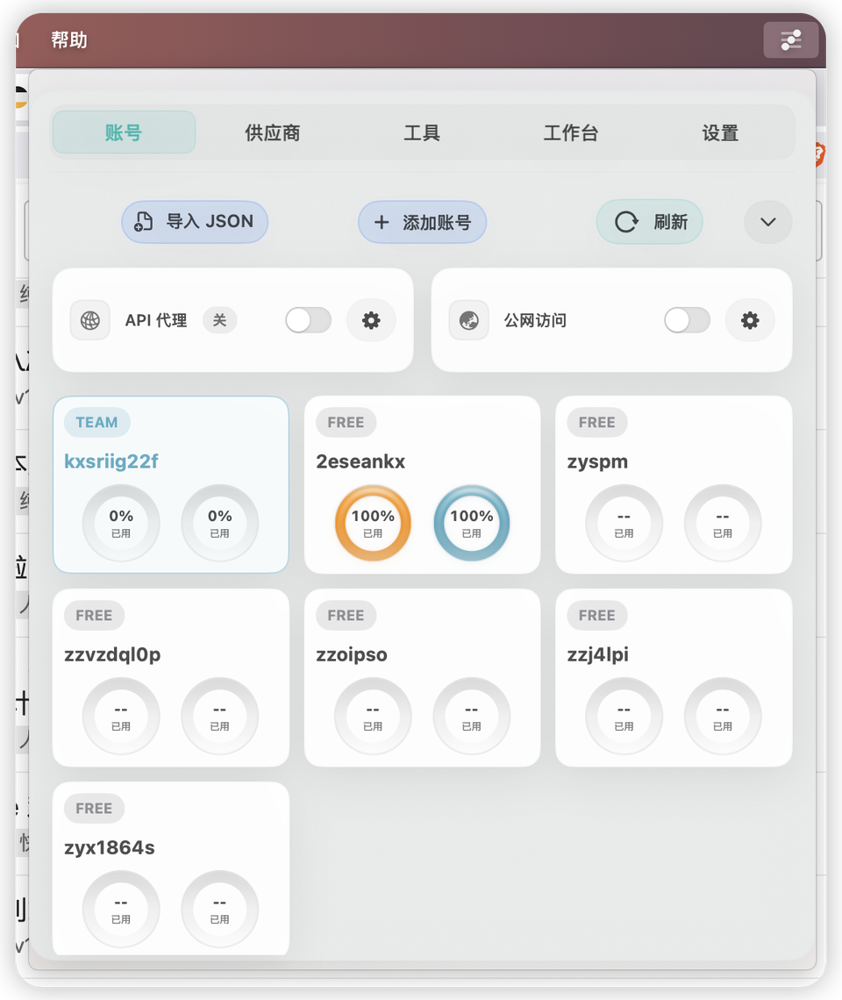
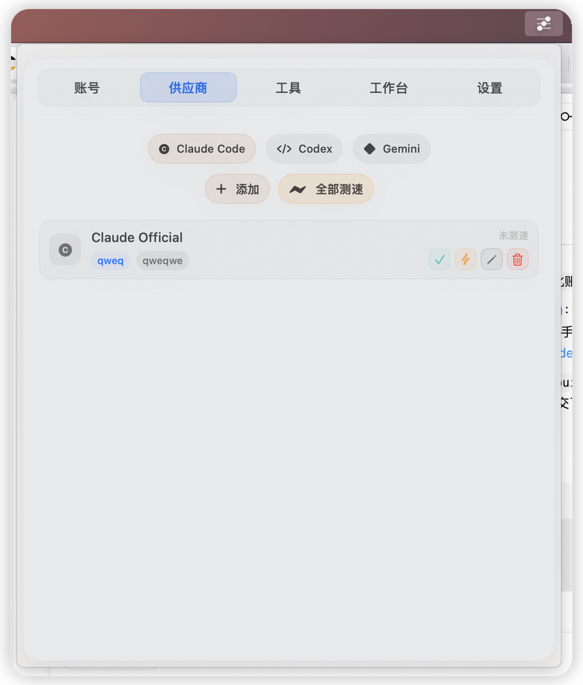
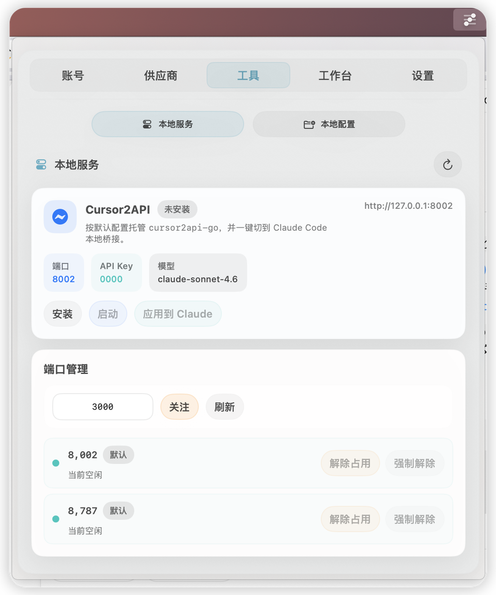
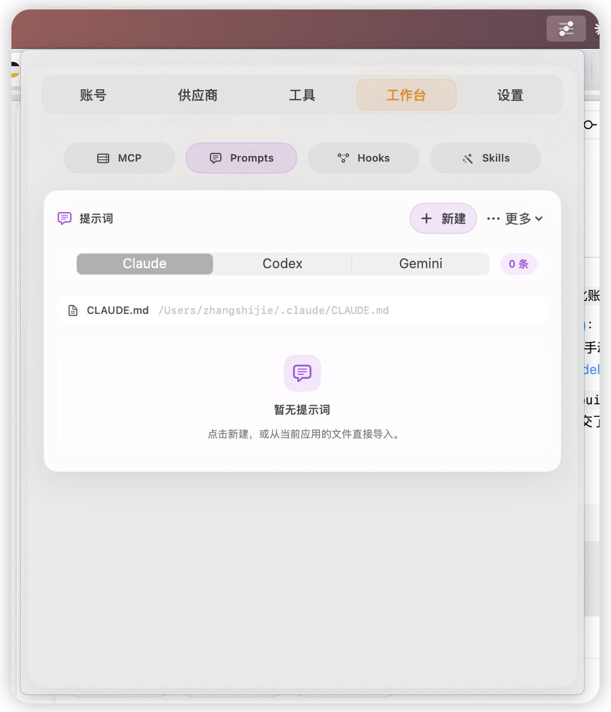

<div align="center">


# AIMenu

**一个原生 macOS 菜单栏控制台，统一管理 Claude Code / Codex / Gemini。**

账号池、供应商、集中代理、MCP、提示词、Hooks、Skills、本地服务，都收进同一个小窗里。

[](https://www.apple.com/macos/)
[](https://swift.org)
[](https://github.com/yourChainGod/AIMenu)
[](https://github.com/yourChainGod/AIMenu/releases/tag/v1.0.6)
[](#国际化)

</div>

---

## 下载

- 最新版本：[`v1.0.6`](https://github.com/yourChainGod/AIMenu/releases/tag/v1.0.6)
- DMG 安装包：[`AIMenu-1.0.6.dmg`](https://github.com/yourChainGod/AIMenu/releases/download/v1.0.6/AIMenu-1.0.6.dmg)
- 安装方式：打开 DMG，把 `AIMenu.app` 拖到 `Applications`

当前 release 已提供可下载 DMG。若后续补上 Developer ID 与 notarization，README 会再同步更新分发说明。

---

## 界面预览

<table>
  <tr>
    <td width="50%" align="center" valign="top">
      
      <div><strong>账号池</strong>：账号列表、集中代理、公网访问统一收口</div>
    </td>
    <td width="50%" align="center" valign="top">
      
      <div><strong>供应商</strong>：按应用切换 provider，并联动测速与模型配置</div>
    </td>
  </tr>
  <tr>
    <td width="50%" align="center" valign="top">
      
      <div><strong>本地服务</strong>：托管 Cursor2API，并管理端口占用</div>
    </td>
    <td width="50%" align="center" valign="top">
      
      <div><strong>工作台</strong>：MCP、提示词、Hooks、Skills 按应用挂载</div>
    </td>
  </tr>
</table>

---

## 上游参考

AIMenu 不是凭空开始的，它是在以下项目启发上继续重构、整合和原生化的结果：

- [AlickH/Copool](https://github.com/AlickH/Copool)：AIMenu 几乎完全基于它继续制作与重构，是当前项目最主要的上游基础
- [kongkongyo/cc-switch](https://github.com/kongkongyo/cc-switch)：多提供商切换与本地配置写入思路
- [Moresl/cchub](https://github.com/Moresl/cchub)：MCP / 提示词 / Hooks / Skills 的工具中台思路
- [yourChainGod/cursor2api-go](https://github.com/yourChainGod/cursor2api-go)：本地 Cursor2API 桥接服务
- [productdevbook/port-killer](https://github.com/productdevbook/port-killer)：端口占用治理思路

---

## 项目定位

Claude Code、Codex、Gemini 都在写各自的本地配置：

- Claude Code：`~/.claude/settings.json`
- Codex：`~/.codex/config.toml` 和 `~/.codex/auth.json`
- Gemini：`~/.gemini/.env`

一旦你开始频繁切换账号、供应商、模型、MCP、提示词、Hooks，终端、编辑器、配置文件和本地服务就会来回跳。

**AIMenu 的目标就是把这些高频操作折叠进一个原生菜单栏面板里：打开小窗，点一下，立即写入，立即生效。**

---

## 核心能力

### 1. 账号池

- 支持本地认证导入、ChatGPT OAuth 登录、批量文件导入
- 按 `7 天 * 0.7 + 5 小时 * 0.3` 做综合排序
- 30 秒自动刷新使用情况
- 可联动 Codex 启动、编辑器重启、OpenCode 认证同步

### 2. 供应商管理

- 内置 **33 个供应商预设**
- Claude Code：20 个
- Codex：8 个
- Gemini：5 个
- 支持官方接口、国内模型平台、聚合平台、自定义代理供应商
- 支持自动拉取模型列表、接口测速、代理配置、计费配置
- 修改后直接写入本地配置文件，不需要手动再去改 JSON / TOML / ENV

### 3. 集中代理与公网访问

- 内置本地 API 代理，一键启动 / 停止
- 自动选择可用端口
- Codex 可自动切换到 AIMenu 生成的集中代理 provider
- 支持 Cloudflared 快速隧道与命名隧道
- 适合把本地代理暴露到公网或做远程接入

### 4. 工具工作台

- **MCP**：预设导入、自定义 STDIO / HTTP / SSE，且可按 Claude / Codex / Gemini 分别挂载
- **提示词**：统一管理 `CLAUDE.md`、`AGENTS.md`、`GEMINI.md`
- **Hooks**：管理 Claude / Codex / Gemini 的事件挂载，并支持按具体 App 生效
- **Skills**：从 GitHub 仓库发现、预览、安装、卸载与自定义仓库
- **本地配置总览**：一眼查看关键配置文件是否存在、最后修改时间和大小

### 5. 本地服务

- 托管 [cursor2api-go](https://github.com/yourChainGod/cursor2api-go)，自动生成配置、拉起进程、健康检查、收集日志
- 内置端口管理，可查看 PID、进程名，并执行解除占用 / 强制解除占用

### 6. Web Remote

- 提供局域网可访问的 Web Remote 页面
- Tools 页支持直接打开浏览器、复制访问链接、二维码扫码连接
- 移动端补齐底部标签栏、快捷操作区、连接摘要与认证提示
- 适合在手机或平板上远程查看状态、切换账号与执行快捷操作

---

## 写入哪些文件

```text
Claude Code
  ~/.claude/settings.json             # provider、MCP、hooks、通用配置
  ~/.claude/CLAUDE.md                 # 提示词
  ~/.claude/skills/                   # 已安装技能

Codex
  ~/.codex/auth.json                  # 认证信息
  ~/.codex/config.toml                # provider、运行参数
  ~/.codex/hooks.json                 # hooks
  ~/.codex/skills/                    # 已安装技能
  ~/.codex/AGENTS.md                  # 提示词

Gemini
  ~/.gemini/.env                      # 认证信息
  ~/.gemini/settings.json             # provider、hooks
  ~/.gemini/skills/                   # 已安装技能
  ~/.gemini/GEMINI.md                 # 提示词

AIMenu
  ~/Library/Application Support/AIMenu/
```

---

## 设计原则

- **原生 macOS 菜单栏体验**：不是 Web 包壳，而是原生 SwiftUI 小窗
- **本地优先**：不依赖后端，不要求云同步，状态都保存在本机
- **配置即结果**：界面修改后直接落到真实配置文件，而不是只存一份“应用内状态”
- **智能联动**：账号池、供应商、代理、本地服务、MCP、Hooks、提示词之间尽量自动接上
- **尽量保留已有配置**：例如 Codex 的 `config.toml` 会增量写入根字段，已有段落会尽量保留

---

## 当前实现亮点

- MVVM + Coordinator 结构
- Swift 6 `actor` 并发模型
- 原子写入与损坏恢复
- 认证文件权限控制（如 `chmod 600`）
- Rust 本地代理内核
- 26 个测试文件覆盖账号、供应商、代理、工具页、本地服务、Web Remote 等核心逻辑

---

## 构建与运行

### 环境要求

- macOS 14+
- Xcode 16+
- Swift 6

### 使用 SwiftPM

```bash
swift build
swift test
```

### 使用 Xcode

```bash
xcodebuild -project AIMenu.xcodeproj -scheme AIMenu \
  -destination 'platform=macOS' build
```

如果你需要重新生成工程文件，项目根目录已经包含 `project.yml`。

---

## 项目结构

```text
Sources/AIMenu/
  App/                  入口、场景装配、窗口行为
  Features/             Accounts / Providers / Proxy / Tools / Settings
  Behavior/             协调器与业务编排
  Domain/               模型、协议、预设、配置结构
  Infrastructure/       文件 I/O、HTTP、Shell、OAuth、本地服务
  Layout/               尺寸与布局常量
  UI/                   公共组件与样式
  Resources/            本地化、图标、代理源码

Tests/AIMenuTests/      17 个测试文件
```

---

## 国际化

目前内置 11 种语言：

- English
- 简体中文
- 繁體中文
- 日本語
- 한국어
- Français
- Deutsch
- Italiano
- Español
- Русский
- Nederlands

应用内支持运行时切换语言，无需重启。

---

## 适合谁

- 每天在 Claude Code / Codex / Gemini 之间切换的人
- 同时维护多个 API 供应商、代理节点、本地模型入口的人
- 想把 MCP、提示词、Hooks、Skills 统一管理起来的人
- 希望用一个更轻、更快的原生菜单栏工具替代手改配置文件的人

---

## 声明

- AIMenu 与 Anthropic、OpenAI、Google 等服务商无官方隶属关系
- 本项目的核心能力是帮助你管理本地配置、账号和代理，不代替各平台自身的服务条款与计费规则
